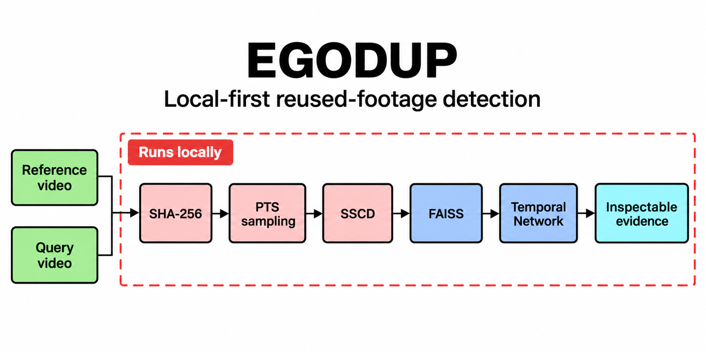
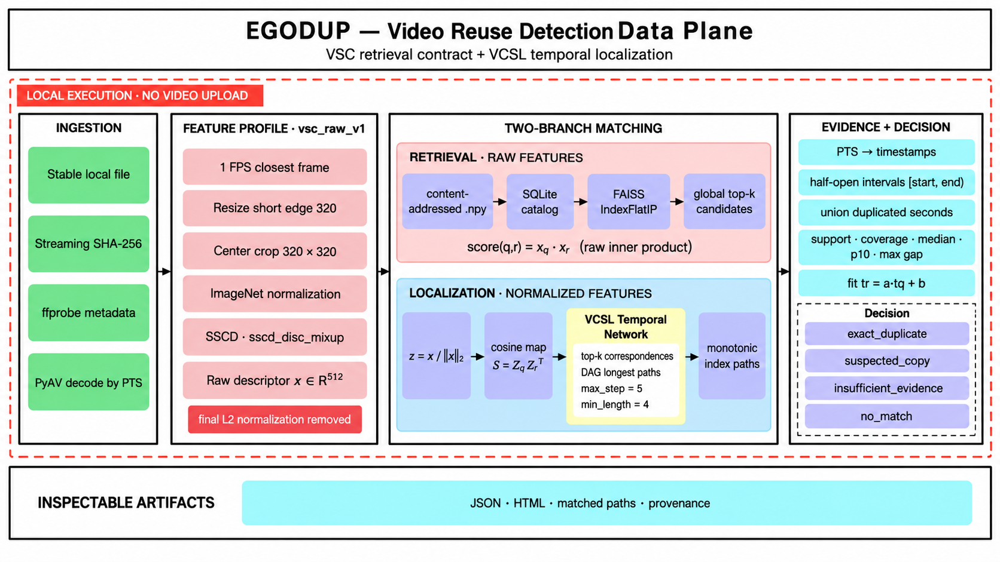
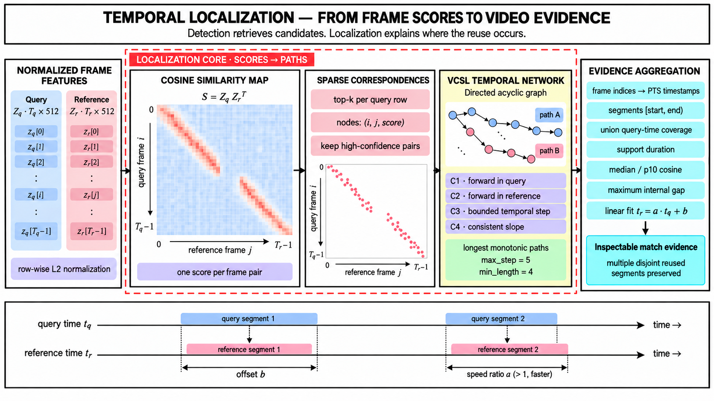
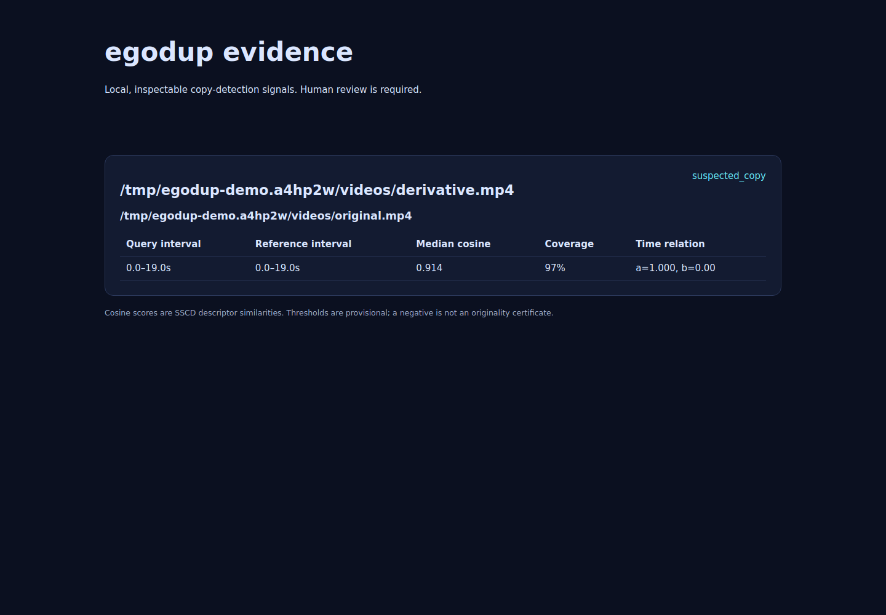
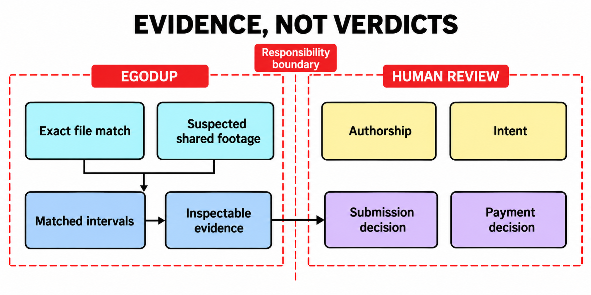

<p align="center">
  
</p>

<p align="center">
  <a href="https://github.com/Fenon-Robotics/egodump/actions/workflows/ci.yml"></a>
  <a href="LICENSE"></a>
  
  
</p>

<p align="center">
  <strong>Find reused source footage in egocentric video submissions—even after re-encoding, trimming, resizing, or modest visual and temporal edits.</strong>
</p>

`egodup` is a local-first command-line tool from [Fenon Robotics](https://github.com/Fenon-Robotics). It combines exact hashing, learned frame descriptors, vector retrieval, and temporal alignment to identify suspicious shared footage and report the corresponding intervals with evidence a reviewer can inspect.

> [!IMPORTANT]
> `egodup` is an experimental review tool. It does not determine fraud, authorship, intent, or payment eligibility. Its thresholds are provisional, and a negative result is not proof that footage is original.

## Why egodup?

Large video collections make manual duplicate checks slow, while exact hashes miss any file that has been re-encoded or edited. Generic video similarity can create the opposite problem: two legitimate recordings of the same task may look alike without sharing source footage.

`egodup` is designed around a narrower question:

> **Do these files appear to contain the same underlying recorded footage, and where is the shared interval?**

It keeps exact equality, perceptual inference, execution status, and human judgment separate in both code and reports.

## What it does—and what it does not

| It does | It does not |
|---|---|
| Detect byte-identical files with SHA-256. | Label people or organizations as fraudulent. |
| Propose transformed copies with SSCD descriptors. | Prove who recorded a video or which copy came first. |
| Localize corresponding query/reference intervals. | Treat visually similar independent recordings as intentional copies. |
| Preserve actual sampled timestamps and matched paths. | Claim frame-accurate boundaries from 1 FPS sampling. |
| Produce typed JSON/JSONL and offline HTML evidence. | Upload source videos or require remote inference. |
| Run on CPU or one explicitly selected CUDA device. | Automatically delete footage, reject submissions, or make payment decisions. |
| Record incomplete searches and processing failures honestly. | Turn a failed or partial search into a clean negative result. |

<p align="center">
  
</p>

## How it works

```text
local video
   ├─ SHA-256 equality ───────────────────────────────► exact_duplicate
   └─ presentation-time sampling at 1 FPS
        └─ SSCD raw 512-dimensional descriptors
             └─ FAISS raw inner-product retrieval
                  └─ bounded cosine similarity matrices
                       └─ VCSL Temporal Network paths
                            └─ evidence gates + review report
```

The initial `vsc_raw_v1` feature contract deliberately preserves the distinction used by the VSC baseline:

- retrieval searches **raw float32 descriptors** with inner product;
- localization normalizes bounded working copies and uses **cosine similarity**;
- raw retrieval scores are never presented as probabilities;
- every supported segment retains its matched timestamp pairs and fitted time relation.

That split is intentional. The adapted `sscd_disc_mixup` checkpoint emits the pre-normalization 512-dimensional descriptor used by the VSC retrieval baseline. Only the localization branch applies row-wise L2 normalization, producing the cosine map consumed by the Temporal Network. Optional background-score normalization described by SSCD/VSC is a separate retrieval profile and is not silently approximated in v1.

### Temporal localization

<p align="center">
  
</p>

Detection and localization answer different questions. Flat FAISS search proposes likely reference videos; localization explains *where* their footage corresponds. For each bounded query/reference window, egodup builds `S = Zq Zrᵀ`, keeps strong frame correspondences, and runs the VCSL Temporal Network to recover forward, temporally consistent paths. It then maps path indices back through the decoder's presentation timestamps—not an assumed frame clock—and preserves multiple disjoint segments.

Evidence gates operate on the recovered paths: distinct support duration, query-time coverage, maximum internal gap, median and tenth-percentile cosine, and the fitted relation `t_reference = a × t_query + b`. The JSON and HTML reports expose those inputs so a reviewer can inspect the basis of a `suspected_copy` decision.

See [architecture](docs/architecture.md) and [upstream provenance](third_party/UPSTREAM.md) for the technical details.

## Quick start

### Requirements

- Python 3.11 or 3.12
- FFmpeg and `ffprobe`
- enough disk space for PyTorch and the separately downloaded 98.8 MB SSCD checkpoint
- optional NVIDIA GPU for `--device cuda:0`

```bash
git clone https://github.com/Fenon-Robotics/egodump.git
cd egodump
python -m venv .venv
source .venv/bin/activate
python -m pip install -e '.[dev]'

egodup doctor
egodup models fetch sscd-disc-mixup
```

The model command downloads only the approved artifact in [`models.lock.json`](models.lock.json), verifies its SHA-256, removes its final L2-normalization layer using the pinned VSC adaptation, and runs structural plus real-image parity checks before publishing it to the local cache.

For an offline or operator-controlled setup:

```bash
egodup models fetch sscd-disc-mixup \
  --source /approved/sscd_disc_mixup.torchscript.pt
```

## Usage

### Compare two videos

```bash
egodup compare original.mp4 submitted.mp4 \
  --device cpu \
  --report comparison.json
```

### Build and search a reference collection

```bash
egodup init --db ./egodup-db

egodup index ./accepted-videos \
  --db ./egodup-db \
  --recursive \
  --device cuda:0

egodup scan ./vendor-upload \
  --db ./egodup-db \
  --recursive \
  --within-batch \
  --device cuda:0 \
  --report results.jsonl
```

`index` registers references; it is not a quality-approval action. `scan` never promotes submissions into the persistent reference collection and never modifies source media.

### Generate offline review evidence

```bash
egodup report results.jsonl --html review/index.html
```

<p align="center">
  
</p>

## Decisions and exit codes

| Decision | Meaning |
|---|---|
| `exact_duplicate` | The query has the same complete-file SHA-256 as a reference or another submission. |
| `suspected_copy` | One or more localized paths pass the configured evidence gates; review is required. |
| `no_match_found` | Processing completed within the declared policy and found no supported match. This is not an originality certificate. |
| `insufficient_evidence` | Too little usable footage, ambiguity, or incomplete processing prevents a useful negative conclusion. |

| Exit code | Meaning |
|---|---|
| `0` | Completed, whether or not a match was found. |
| `1` | Operational or incomplete-processing error. |
| `2` | Invalid arguments or configuration. |
| `3` | A match was found while `--fail-on-match` was enabled. |

Machine-readable results go only to the requested file or stdout. Logs and progress go to stderr. Existing reports are not overwritten without `--overwrite`.

## Evidence, not verdicts

<p align="center">
  
</p>

A perceptual match is an inference about shared visual content. It is not cryptographic proof of a re-encode, evidence of intent, or a statement about the people behind either file. Reports therefore expose the underlying evidence instead of inventing a confidence probability:

- half-open query and reference intervals;
- distinct matched samples and supported duration;
- support coverage and largest internal gap;
- median and tenth-percentile cosine similarity;
- timestamp uncertainty and individual correspondences;
- the fitted local relation `t_reference = a × t_query + b`;
- execution errors, search completeness, active profiles, and provisional calibration status.

## Current scope

The 0.1.x line is a tested engineering baseline, not a calibrated production detector.

**Implemented:** exact duplicates, pairwise comparison, content-addressed feature caching, SQLite catalogues, raw FAISS retrieval, transformed-copy localization, within-batch checks, index rebuilds, JSON/JSONL, offline HTML, CPU and single-GPU execution, deterministic fixtures, package builds, and model-integrity validation.

**Evaluated as intended use cases, not guaranteed:** re-encoding, ordinary frame-rate changes, resizing, mild color changes, trims, temporal offsets, moderate speed changes, and copied segments embedded in longer footage.

**Not supported as v1 claims:** reverse playback, severe crops, picture-in-picture, extensive synthetic edits, adaptive attacks, authorship verification, signed capture, audio fingerprinting, cloud storage connectors, or distributed execution.

Known engineering constraints—including the current 240-sample pair window and uncalibrated optional verification—are tracked in [limitations](docs/limitations.md).

## Validation

The repository is tested on Python 3.11 and 3.12 in GitHub Actions. An isolated Lambda Cloud A10 validation downloaded the full dependency set and model directly, then exercised lint, tests, model adaptation, CUDA comparison, index, scan, rebuild, report generation, and packaging before the VM was terminated.

On the deterministic 18-second transformed fixture:

| Environment | Result |
|---|---|
| NVIDIA A10 | 3.20 s end to end; 1.85 s SSCD inference |
| Detection | 19 samples; 97.4% coverage; median cosine 0.902 |
| CPU portability host | 240.09 s end to end; 214.65 s inference |

These are engineering measurements on one synthetic pair—not accuracy or throughput claims. See [measured validation](docs/benchmarks.md).

## Development

```bash
python -m pip install -e '.[dev]'
ruff check src tests tools
pytest
python -m build
```

Useful fixture and evaluation utilities live under [`tools/`](tools/). Contributions are welcome—please read [CONTRIBUTING.md](CONTRIBUTING.md), our [Code of Conduct](CODE_OF_CONDUCT.md), and the [security policy](SECURITY.md).

## Roadmap

- complete overlapping-window localization beyond the current 240-sample bound;
- materialize privacy-controlled side-by-side frame thumbnails;
- finish separately calibrated random verification;
- validate crash recovery and immutable index generation switching under interruption;
- build a held-out egocentric industrial evaluation set with same-task hard negatives;
- replace provisional evidence gates with a versioned calibration;
- evaluate compressed retrieval only against the flat-search correctness baseline.

## Research and attribution

The implementation builds narrowly on:

- Pizzi et al., [The 2023 Video Similarity Dataset and Challenge](https://arxiv.org/abs/2306.09489) and the pinned [VSC SSCD baseline](https://github.com/facebookresearch/vsc2022/blob/644d52118297d8eeaf9ef7483b0246fdf4c8292b/docs/baseline.md);
- Pizzi et al., [A Self-Supervised Descriptor for Image Copy Detection](https://arxiv.org/abs/2202.10261) and [SSCD](https://github.com/facebookresearch/sscd-copy-detection/tree/95902662f2217a5f4aa45f2a3fc70a01dfd3b66a);
- He et al., [Video Copy Segment Localization](https://arxiv.org/abs/2203.02654) and [VCSL](https://github.com/alipay/VCSL/tree/29ce63909ce605a73335ce48d1e21f395b4b503c).

Vendored/adapted code, revisions, licenses, and local changes are recorded in [`THIRD_PARTY_NOTICES.md`](THIRD_PARTY_NOTICES.md) and [`third_party/UPSTREAM.md`](third_party/UPSTREAM.md). The SSCD checkpoint is downloaded separately and is not redistributed in this repository.

## License

`egodup` is released under the [MIT License](LICENSE). Copyright © 2026 Fenon Robotics.
