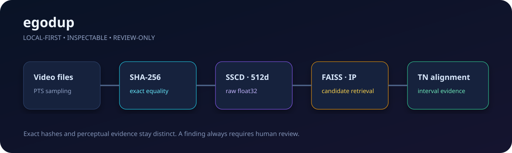

# egodup




Local-first duplicate-footage detection for egocentric video submissions. `egodup` distinguishes exact files with SHA-256, proposes perceptual candidates with raw SSCD descriptors and FAISS inner-product search, then localizes copied intervals with a narrowly adapted VCSL Temporal Network.

> **Experimental release.** Findings are review signals—not fraud determinations, originality certificates, or grounds for automatic payment decisions. The bundled `development-v1` evidence thresholds are provisional.

## What works

- exact-file matches, including aliases inside a submission batch;
- pairwise transformed-copy localization with sampled timestamp correspondences;
- persistent, content-addressed feature caches and SQLite reference catalogues;
- raw-feature FAISS retrieval without accidental cosine normalization;
- CPU or one explicitly selected CUDA device;
- JSON/JSONL results and a self-contained offline evidence report;
- checksum-verified, explicitly fetched SSCD model; normal operation can remain offline.

The current `0.1.0` is an engineering baseline, not a calibrated production detector. Candidate matrices are capped at 240 × 240 samples (four-minute windows), verification scores remain `uncalibrated`, and corpus sharding/recovery are intentionally conservative. See [limitations](docs/limitations.md).

Measured CPU/A10 engineering checks are recorded in [benchmarks](docs/benchmarks.md); they are not accuracy claims.

## Install

Python 3.11 is the release target (3.12 is tested as well). FFmpeg/ffprobe must be available.

```bash
python -m pip install -e '.[dev]'
egodup doctor
egodup models fetch sscd-disc-mixup
```

The model fetch accepts only the approved URL/checksum in `models.lock.json`. For an air-gapped setup:

```bash
egodup models fetch sscd-disc-mixup --source /approved/sscd_disc_mixup.torchscript.pt
```

## Use

```bash
egodup compare original.mp4 submitted.mp4 --device cpu --report comparison.json

egodup init --db ./egodup-db
egodup index ./accepted-videos --db ./egodup-db --recursive --device cuda:0
egodup scan ./vendor-upload --db ./egodup-db --recursive --within-batch \
  --device cuda:0 --report results.jsonl

egodup report results.jsonl --html review/index.html
egodup stats --db ./egodup-db
egodup rebuild --db ./egodup-db
```

Machine-readable output goes only to the requested file or stdout. Operational messages use stderr. Reports refuse overwrite unless `--overwrite` is supplied. Explicitly requesting unavailable CUDA is an error; it never silently falls back.

## Decision vocabulary

| Decision | Meaning |
|---|---|
| `exact_duplicate` | Query bytes have the same SHA-256 as a reference/submission. |
| `suspected_copy` | One or more localized paths pass provisional evidence gates. |
| `no_match_found` | Declared processing completed and found no supported match; not proof of originality. |
| `insufficient_evidence` | Too little usable footage or incomplete/ambiguous evidence. |

Execution status and search completeness are separate fields. Processing errors never masquerade as negative findings.

## Evidence contract

SSCD features are stored as raw float32 descriptors. Retrieval uses raw inner product; localization normalizes working copies and uses cosine similarity. Each segment includes half-open query/reference intervals, actual timestamp pairs, score distribution, coverage, largest gap, boundary uncertainty, and the fitted relation `t_reference = a × t_query + b`. A 2× sped-up query should therefore produce `a ≈ 2`.

## Development

```bash
pytest
ruff check src tests
python -m build
```

Primary technical references are the [VSC 2023 baseline](https://github.com/facebookresearch/vsc2022/blob/644d52118297d8eeaf9ef7483b0246fdf4c8292b/docs/baseline.md), [SSCD](https://github.com/facebookresearch/sscd-copy-detection/tree/95902662f2217a5f4aa45f2a3fc70a01dfd3b66a), and [VCSL](https://github.com/alipay/VCSL/tree/29ce63909ce605a73335ce48d1e21f395b4b503c). Attribution and local changes are in [third_party/UPSTREAM.md](third_party/UPSTREAM.md).
